# WebGPU 太空射击游戏 — 代码阅读指南

## 项目目录总览

```
src/
├── main.ts              ← 入口：初始化引擎、创建游戏对象、启动主循环
├── engine/              ← 引擎层：WebGPU 初始化、游戏循环、资源加载、输入管理
│   ├── engine.ts
│   ├── content.ts
│   └── input-manager.ts
├── core/                ← 核心渲染：纹理、精灵、渲染管线、批处理渲染器
│   ├── texture.ts
│   ├── sprite.ts
│   ├── sprite-font.ts
│   ├── sprite-pipeline.ts
│   └── sprite-renderer.ts
├── utils/               ← 工具类：数据结构、GPU 缓冲区、碰撞检测、摄像机
│   ├── rect.ts
│   ├── color.ts
│   ├── quad.ts
│   ├── geometry.ts
│   ├── buffer-util.ts
│   ├── camera.ts
│   └── circle-collider.ts
├── effects/             ← 后处理效果：泛光、模糊、纹理混合
│   ├── bloom-effect.ts
│   ├── bloom-blur-effect.ts
│   ├── blur-effect.ts
│   ├── texture-effect.ts
│   ├── post-process-effect.ts
│   └── effects-factory.ts
├── game/                ← 游戏逻辑：玩家、敌人、子弹、爆炸、背景、UI
│   ├── enemy.ts
│   ├── meteor-enemy.ts
│   ├── enemy-manager.ts
│   ├── player.ts
│   ├── bullet.ts
│   ├── bullet-manager.ts
│   ├── explosion.ts
│   ├── explosion-manager.ts
│   ├── background.ts
│   └── high-score.ts
└── shaders/             ← WGSL 着色器
    ├── shader.wgsl
    ├── bloom-effect.wgsl
    ├── blur-effect.wgsl
    ├── texture-effect.wgsl
    └── post-process.wgsl
```

---

## 推荐阅读顺序

> 按从底层到顶层的顺序阅读，每一层只依赖前一层。

```mermaid
graph LR
    subgraph "第①层 基础数据结构"
        A[rect / color / quad]
        A2[geometry]
    end
    subgraph "第②层 GPU 基础设施"
        B[buffer-util]
        C[camera]
        D[texture]
    end
    subgraph "第③层 核心渲染"
        E[sprite]
        F[sprite-font]
        G[sprite-pipeline]
        H[sprite-renderer]
    end
    subgraph "第④层 引擎系统"
        I[content]
        J[input-manager]
        K[engine]
    end
    subgraph "第⑤层 后处理"
        L[post-process-effect]
        M[texture-effect]
        N[blur-effect]
        O[bloom-blur-effect]
        P[bloom-effect]
        Q[effects-factory]
    end
    subgraph "第⑥层 游戏逻辑"
        R[enemy / player / bullet / ...]
    end
    subgraph "第⑦层 入口"
        S[main.ts]
    end

    A --> B & C & D
    B & D --> G & H
    A --> E & F
    D --> E & F
    E --> I
    F --> I
    G --> H
    C --> H
    H --> K
    I --> K
    J --> K
    B & D --> L & M & N & O
    N --> O --> P
    L --> Q
    M --> Q
    P --> Q
    K --> S
    Q --> S
    R --> S
```

### 具体阅读顺序

| 阶段 | 文件 | 关注点 |
|------|------|--------|
| **① 基础数据结构** | `utils/rect.ts` `color.ts` `quad.ts` `geometry.ts` | 贯穿项目的基础类型，先了解数据长什么样 |
| **② GPU 基础** | `utils/buffer-util.ts` | GPU Buffer 三种类型（Vertex/Index/Uniform）及 `mappedAtCreation` 写入方式 |
| | `utils/camera.ts` | 正交投影矩阵如何将 2D 坐标映射到屏幕 |
| | `core/texture.ts` | GPU 纹理和采样器的创建，`copyExternalImageToTexture` 上传像素数据 |
| **③ 核心渲染** | `core/sprite.ts` | 精灵 = 纹理 + 绘制矩形 + 源矩形（理解纹理图集的概念） |
| | `core/sprite-font.ts` | 位图字体的字符描述（UV 坐标、advance、offset） |
| | `shaders/shader.wgsl` | **对照 sprite-pipeline.ts 一起读** — 理解顶点布局与着色器 `@location` 的对应关系 |
| | `core/sprite-pipeline.ts` | GPU 渲染管线：顶点布局、Bind Group、Blend 状态、MRT 多目标输出 |
| | `core/sprite-renderer.ts` | **项目核心** — 批处理渲染器：帧生命周期、按纹理分批、顶点数据填充、Buffer 池复用 |
| **④ 引擎系统** | `engine/content.ts` | 资源加载：纹理图集 XML 解析、BMFont 位图字体加载 |
| | `engine/input-manager.ts` | 简单的键盘状态管理 |
| | `engine/engine.ts` | **项目骨架** — WebGPU 初始化全流程、游戏主循环、MRT 双附件渲染 |
| **⑤ 后处理** | `shaders/post-process.wgsl` | 最简单的全屏后处理着色器（灰度） |
| | `effects/post-process-effect.ts` | 后处理基类：全屏四边形 + 单纹理采样 |
| | `shaders/blur-effect.wgsl` | 高斯模糊着色器：可分离滤波、权重数组 |
| | `effects/blur-effect.ts` | 双通道模糊：水平通道 + 垂直通道 |
| | `effects/bloom-blur-effect.ts` | 乒乓模糊：在两张纹理间交替读写 |
| | `shaders/bloom-effect.wgsl` | 泛光合成着色器 |
| | `effects/bloom-effect.ts` | 泛光管线：亮度提取 → 10 次乒乓模糊 → 合成 |
| | `effects/effects-factory.ts` | 工厂模式统一创建后处理效果 |
| **⑥ 游戏逻辑** | `utils/circle-collider.ts` | 圆形碰撞检测 |
| | `game/enemy.ts` | 敌人接口定义 |
| | `game/meteor-enemy.ts` | 陨石敌人实现（纹理图集随机选取、旋转） |
| | `game/player.ts` | 玩家（方向键移动、边界约束） |
| | `game/bullet.ts` | 子弹（从玩家位置发射、向上移动） |
| | `game/explosion.ts` | 爆炸动画（4×4 精灵表逐帧播放） |
| | `game/background.ts` | 滚动背景（双图交替无缝循环） |
| | `game/high-score.ts` | 分数 UI（位图字体渲染） |
| | `game/*-manager.ts` | 对象池管理器（子弹/敌人/爆炸的创建回收与碰撞检测） |
| **⑦ 入口** | `main.ts` | 将所有模块组装在一起 |

---

## 模块详解

### 1. utils/ — 基础数据结构与 GPU 工具

| 文件 | 职责 | 核心概念 |
|------|------|----------|
| `rect.ts` | 轴对齐矩形 (x, y, w, h) | 描述精灵在屏幕上的位置和纹理图集中的区域 |
| `color.ts` | RGB 浮点颜色 (0~1) | 顶点颜色着色，默认白色表示不染色 |
| `quad.ts` | 四角坐标 (4 个 Vec2) | 描述任意四边形，主要用于字体字符的 UV 坐标 |
| `geometry.ts` | 硬编码测试四边形 | 展示顶点格式：position(2) + uv(2) + color(3) |
| `buffer-util.ts` | GPU 缓冲区创建工具 | `mappedAtCreation` 写入初始数据、三种 Buffer 用途 |
| `camera.ts` | 2D 正交摄像机 | `mat4.ortho` 生成投影矩阵，坐标原点在左上角 |
| `circle-collider.ts` | 圆形碰撞体 | 两圆心距离 < 半径之和则碰撞 |

**buffer-util.ts 要点：**

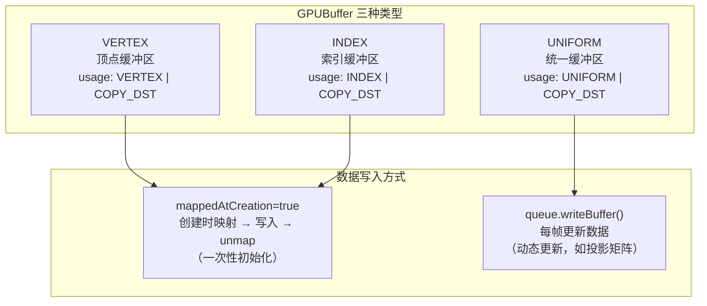

---

### 2. core/ — 核心渲染管线

这是项目最核心的部分，实现了 WebGPU 的精灵渲染管线。

#### 2.1 数据流

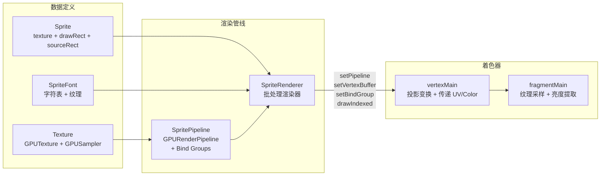

#### 2.2 sprite-renderer.ts — 批处理渲染器

这是整个项目最复杂的文件。核心思想是 **减少 Draw Call**：

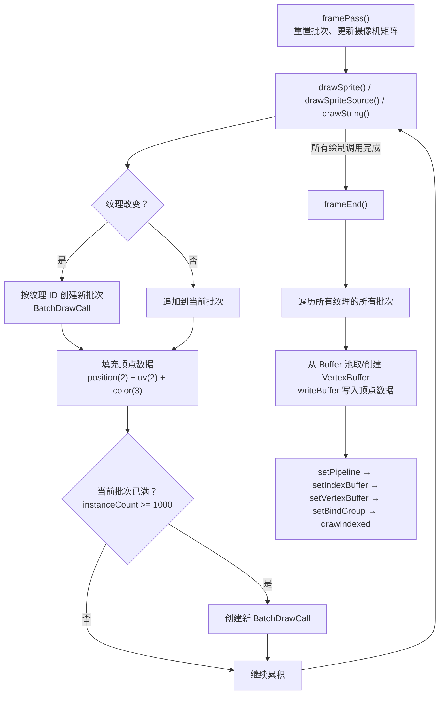

**顶点数据布局（每个精灵 4 个顶点，每个顶点 7 个 float）：**

```
顶点0 (左上):  x, y, u0, v0, r, g, b
顶点1 (右上):  x+w, y, u1, v0, r, g, b
顶点2 (右下):  x+w, y+h, u1, v1, r, g, b
顶点3 (左下):  x, y+h, u0, v1, r, g, b

索引: [0,1,2, 2,3,0]  ← 两个三角形组成一个四边形
```

#### 2.3 sprite-pipeline.ts — 渲染管线配置

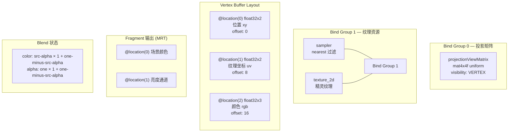

---

### 3. engine/ — 引擎系统

#### 3.1 engine.ts — WebGPU 初始化与游戏循环

**WebGPU 初始化链路：**

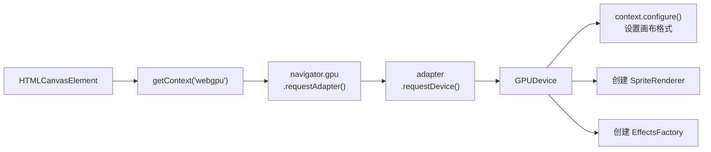

**游戏主循环（每帧执行）：**

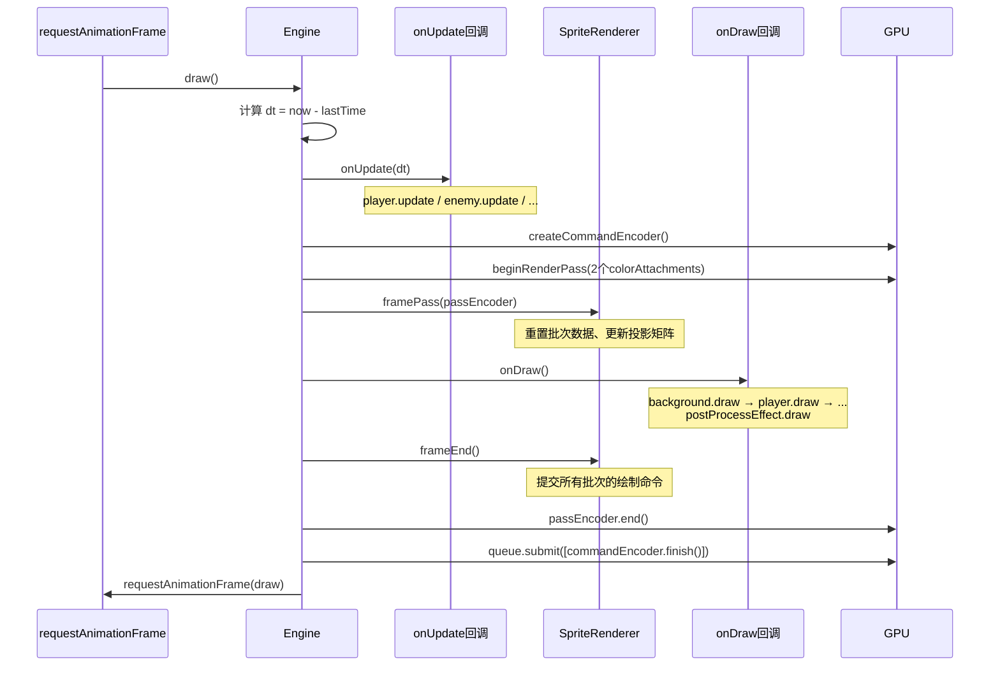

#### 3.2 content.ts — 资源加载

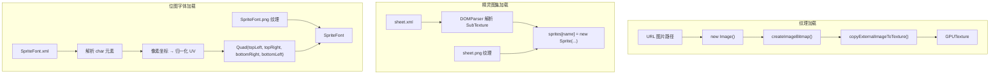

---

### 4. effects/ — 后处理管线

#### 4.1 后处理架构总览

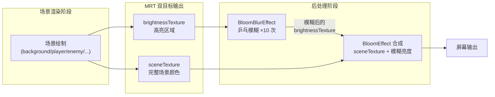

#### 4.2 全屏四边形

所有后处理效果共用同一个顶点数据 — 覆盖整个 NDC 空间 (-1 到 1) 的四边形：

```
(-1, 1)  ────── (1, 1)
   │  ╱  ╲     │
   │╱     ╲    │
(-1,-1)  ────── (1,-1)

6 个顶点 = 2 个三角形
UV 坐标从 (0,0) 到 (1,1) 覆盖整张纹理
```

#### 4.3 高斯模糊 — 可分离滤波优化

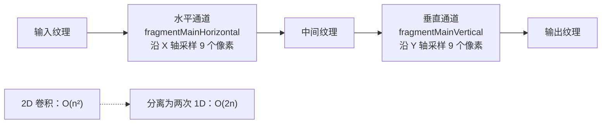

**高斯权重（9-tap 对称核，只需 5 个权重值）：**

| 距离 | 权重 | 采样次数 |
|------|------|----------|
| 0 (中心) | 0.2042 | 1 |
| ±1 | 0.1802 | 2 |
| ±2 | 0.1238 | 2 |
| ±3 | 0.0663 | 2 |
| ±4 | 0.0276 | 2 |

#### 4.4 乒乓模糊 (BloomBlurEffect)

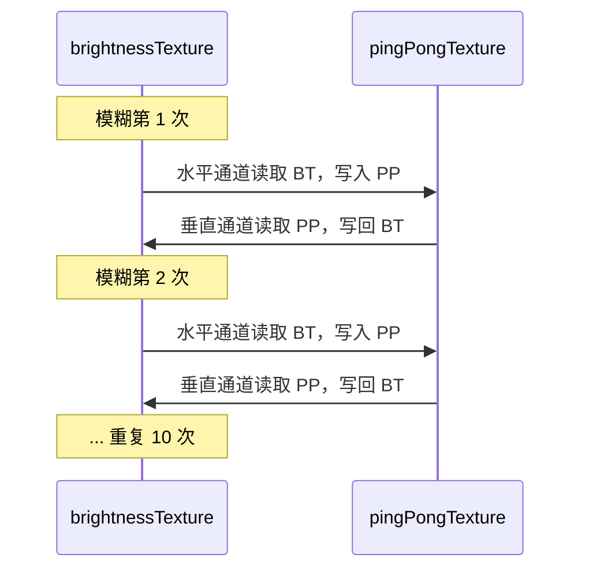

#### 4.5 Bloom 合成着色器

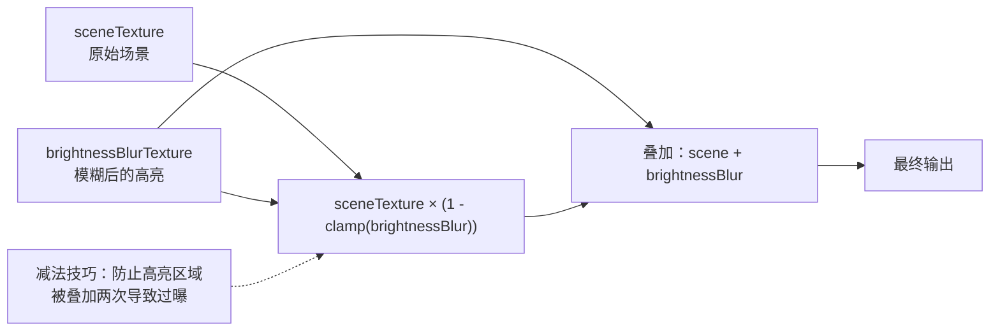

---

### 5. game/ — 游戏逻辑

#### 5.1 游戏对象关系

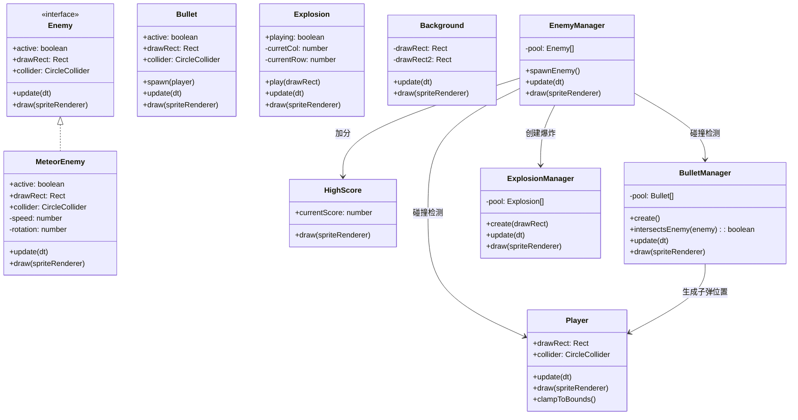

#### 5.2 对象池模式

子弹、敌人、爆炸都使用对象池，避免频繁 GC：

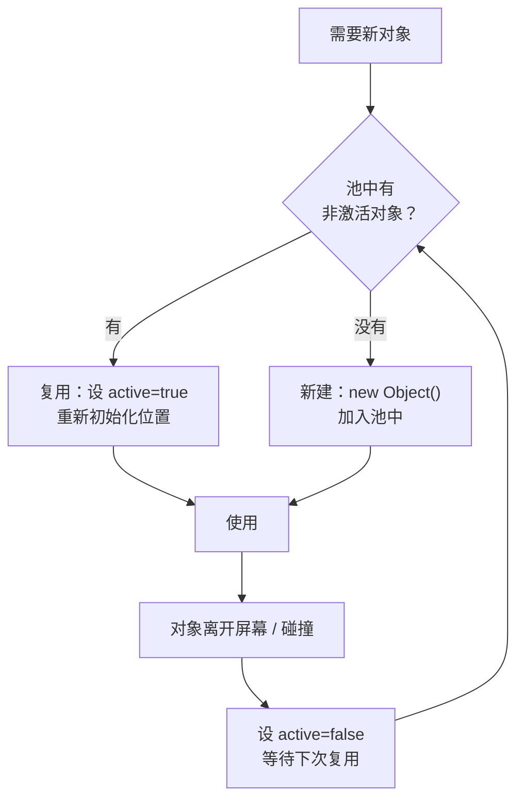

#### 5.3 滚动背景原理

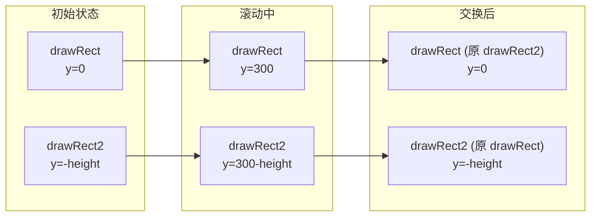

两张背景图上下拼接，持续向下滚动。当第一张完全滚出屏幕底部时，交换两张图的位置，形成无限循环。

---

### 6. shaders/ — WGSL 着色器

| 文件 | 入口函数 | 作用 |
|------|----------|------|
| `shader.wgsl` | `vertexMain` / `fragmentMain` | 主精灵渲染着色器。顶点着色器应用投影矩阵；片元着色器采样纹理并提取亮度（MRT 双输出） |
| `post-process.wgsl` | `vertexMain` / `fragmentMain` | 灰度后处理：取 RGB 平均值 |
| `blur-effect.wgsl` | `fragmentMainHorizontal` / `fragmentMainVertical` | 可分离高斯模糊：水平通道和垂直通道使用相同的权重数组 |
| `bloom-effect.wgsl` | `fragmentMain` | 泛光合成：将原始场景与模糊亮度纹理叠加 |
| `texture-effect.wgsl` | `fragmentMain` | 双纹理线性混合：使用 `mix()` 和 uniform 控制混合比例 |

#### shader.wgsl 数据流

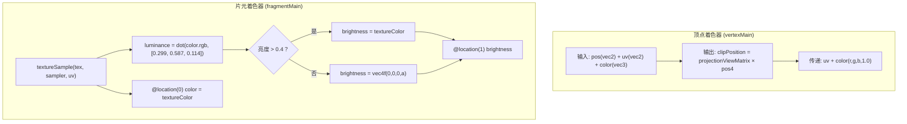

---

## 关键 WebGPU 概念速查

| 概念 | 在项目中的体现 |
|------|----------------|
| **GPUDevice** | `engine.ts` 中通过 adapter.requestDevice() 获取，是所有 GPU 操作的入口 |
| **GPUBuffer** | `buffer-util.ts` 中创建，分 Vertex（顶点）、Index（索引）、Uniform（统一变量）三种 |
| **GPUTexture** | `texture.ts` 中创建，用于存储图像数据；也可作为渲染目标（离屏纹理） |
| **GPUSampler** | `texture.ts` 中创建，控制纹理采样方式（nearest/linear 过滤） |
| **GPURenderPipeline** | `sprite-pipeline.ts` 中创建，定义完整的渲染流程（着色器+顶点布局+混合状态） |
| **GPUBindGroup** | `sprite-pipeline.ts` 中创建，将缓冲区/纹理绑定到着色器的 @group @binding |
| **GPURenderPassEncoder** | `engine.ts` 中创建，记录一帧的所有绘制命令 |
| **GPUCommandEncoder** | `engine.ts` 中创建，编码命令缓冲区，最终 submit 到 GPU 队列 |
| **MRT (多目标渲染)** | `engine.ts` 的 renderPassDescriptor 有两个 colorAttachments：场景颜色 + 亮度 |
| **WGSL** | `shaders/` 中的 .wgsl 文件，WebGPU 的着色器语言，语法类似 Rust |
| **全屏四边形** | 所有后处理效果使用 NDC 坐标 (-1,-1) 到 (1,1) 的四边形覆盖屏幕 |
| **乒乓渲染** | `bloom-blur-effect.ts` 在两张纹理间交替读写，实现多次模糊迭代 |

---

## 一帧的完整执行流程

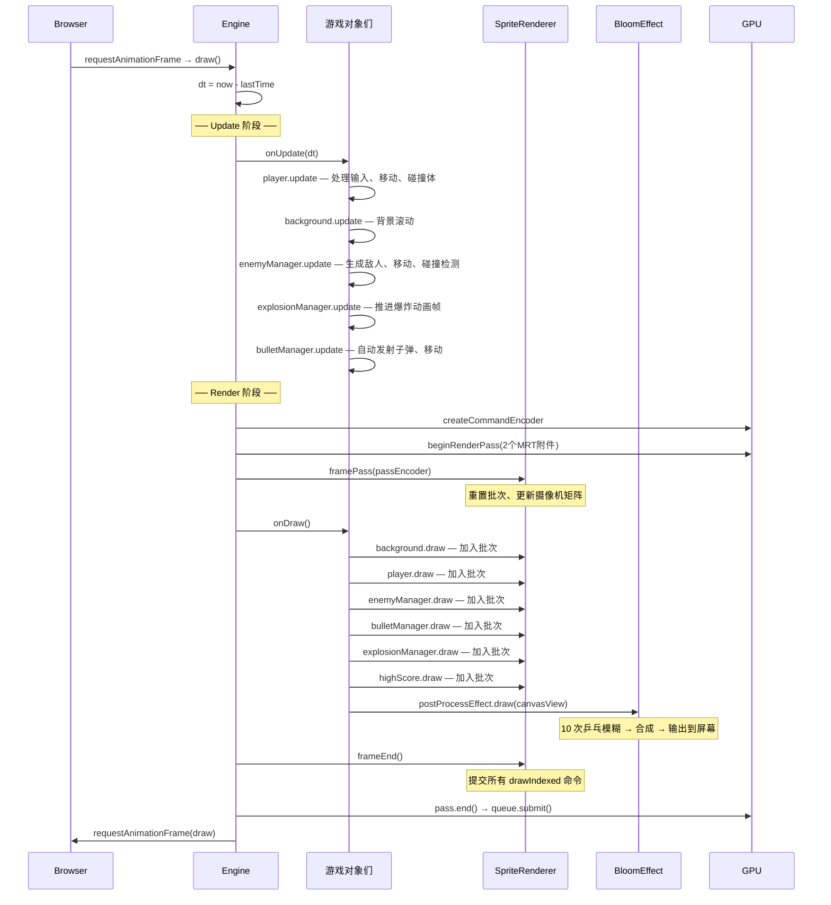
